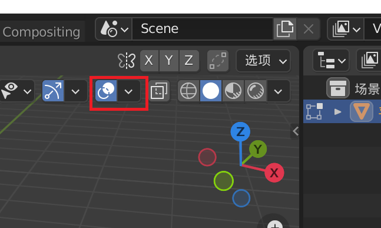

# Blender快捷键记录

### 观察

中键

Shift + 中键

滚轮

"/"键（局部透视）

点击箭头——测量——边长

### 选择

A（全选）

Shift + A（加入新物体，Append）

X（删除）

Shift + D（复制，Duplicate）

P（分离选中项）

### 编辑

Tab

1、2、3（切换编辑选择模式（点线面））

E（挤出来）

Alt + E（高级挤出选项，eg沿法向挤出面，记得单击后，左下角展开，勾选均等偏移）